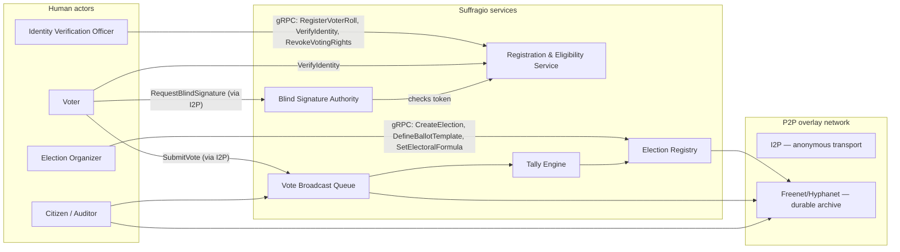
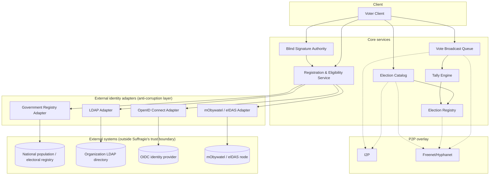
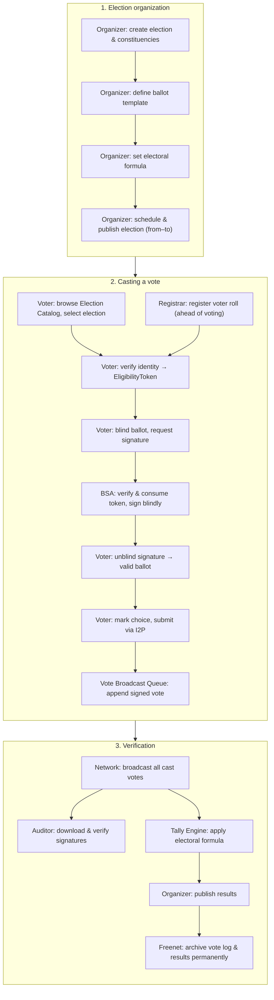

This page proposes a system architecture that satisfies the goals and requirements described in [Motivation & Requirements](/suffragio-spec/motivation/). It is a first design draft, intended as a basis for further discussion and refinement.

## Actors

**Human actors**

- **Voter** — an eligible citizen who verifies their identity, receives a blindly signed ballot, and casts a vote.
- **Election Organizer** — e.g. a member of a national election commission (or any organization). Defines the ballot template, the electoral formula, and publishes the election schedule.
- **Identity Verification Officer (Registrar)** — verifies a voter's identity and eligibility, either electronically (e.g. a qualified signature or a national digital ID) or in person (e.g. a municipal, county, or consular official).
- **Auditor / Citizen Observer** — any citizen who independently downloads and verifies the public vote log, signatures, and published results.

**System actors (services / nodes)**

- **Blind Signature Authority (BSA)** — verifies a voter's eligibility token and blindly signs their ballot, without ever seeing the ballot's content.
- **Vote Broadcast Queue** — a public, append-only, replicated log where every cast vote is broadcast and visible to anyone.
- **Tally Engine** — a pluggable component that applies the configured electoral formula to the vote log after the voting window closes.
- **Election Catalog** — a public, browsable directory of upcoming, ongoing, and past elections, aggregated from every organizer on the network.
- **Network Node Operator** — anyone running a Suffragio node, participating in discovery, broadcast, and archival of election data.



## System components

- **Voter Client** — local application that generates the blinding factor, requests a blind signature, unblinds it, and submits the finished vote.
- **Election Registry** — the source of truth for immutable election configuration: constituencies, ballot templates, the electoral formula, the voting window, and public keys.
- **Registration & Eligibility Service** — validates a voter's identity and constituency, checks the electoral roll and any rights revocations, and issues a single-use `EligibilityToken`.
- **Blind Signature Authority (BSA)** — consumes an `EligibilityToken` and issues a blind signature over a ballot it cannot read, guaranteeing that the act of *authorizing* a ballot is never linkable to the act of *casting* it.
- **Vote Broadcast Queue** — the public, append-only bulletin board of all cast votes. Nothing is ever removed or modified once appended.
- **Tally Engine** — a pluggable module implementing a specific electoral formula (e.g. first-past-the-post, D'Hondt, single transferable vote); consumes the vote queue and produces results.
- **Election Catalog** — a read-only projection built by indexing the `ElectionPublished` and `ElectionScheduled` events broadcast by every organizer on the network. It works like an app-store listing: anyone can browse it, without authenticating, to find an election they may be eligible for and see its schedule, constituencies, and organizer — before starting identity verification.
- **External Identity Adapters (anti-corruption layer)** — a family of adapters that translate a variety of external identity and eligibility sources into the single generic interface the Registration & Eligibility Service depends on. See [External identity integration](#external-identity-integration-anti-corruption-layer) below.
- **P2P overlay network** — see below.

## Component diagram



## Blind-signature ballot issuance

To keep eligibility verification and vote casting cryptographically unlinkable, ballots are issued using a **blind signature** scheme:

1. The voter authenticates with the **Registration & Eligibility Service** (electronically or in person) and receives a single-use `EligibilityToken` for their constituency.
2. The voter locally generates a blank ballot token and blinds it using a random blinding factor.
3. The voter sends the blinded ballot plus the `EligibilityToken` to the **Blind Signature Authority**. The BSA verifies and consumes the token, then signs the *blinded* value — it never sees the real ballot content and cannot link this signing event to any later vote.
4. The voter unblinds the signature locally, obtaining a validly signed, anonymous ballot.
5. The voter marks their choice on the ballot and submits it — over the anonymous network transport, disconnected from their verified identity — to the **Vote Broadcast Queue**.

Because steps 1–3 (identity-linked) and step 5 (anonymous casting) are cryptographically and temporally decoupled, no party — including the BSA and Registration Service — can determine how a specific voter voted, while the signature still proves the ballot came from an eligible, single-use token.

## External identity integration (anti-corruption layer)

Requiring every deployment to use one specific identity system would break the universality and digital-independence requirements: a national government, a company running an internal election, and a small association all have very different sources of truth for "who is allowed to vote, and in what constituency." The **Registration & Eligibility Service** therefore never talks to an external identity system directly. It depends only on a small, generic internal port:

```text
IdentityProvider.verify(claimantProof) -> { eligible: bool, voterId, constituencyId }
IdentityProvider.isRevoked(voterId) -> bool
```

Each concrete integration is implemented as an **adapter** behind this port — an application of the anti-corruption layer pattern: the quirks, data models, and legacy protocols of an external system are translated and isolated in the adapter, so they never leak into Suffragio's core domain model. Proposed adapters:

- **Government Registry Adapter** — read-only integration with a national civil/electoral registry (e.g. a PESEL-based population register), used to resolve a citizen's eligibility and constituency for national elections.
- **mObywatel / eIDAS Adapter** — electronic identity verification via a national digital-identity wallet (e.g. Poland's mObywatel) or, for cross-border/EU use, any [eIDAS](https://digital-strategy.ec.europa.eu/en/policies/eidas-regulation)-compliant equivalent notified by another EU member state.
- **LDAP Adapter** — for organizations that already maintain their electorate in a directory (e.g. a company or association), resolving eligibility straight from an LDAP/Active Directory tree.
- **OpenID Connect Adapter** — federated identity via any OIDC-compliant identity provider (corporate SSO, Keycloak, Google Workspace, etc.), suitable for community or organizational elections that already have a login system.

New backends only require a new adapter implementing the same `IdentityProvider` port — the rest of the system, including the blind-signature flow, is completely unaffected.

## Communication: gRPC

All communication between the Voter Client, the Election Registry, the Registration & Eligibility Service, the Blind Signature Authority, the Vote Broadcast Queue, and the Tally Engine happens over **gRPC**:

- **Commands** are unary gRPC calls that mutate state.
- **Events** are published on gRPC server-streaming subscriptions (and mirrored onto the public Vote Broadcast Queue / archive where relevant), so any node or auditor can subscribe and independently reconstruct the full election state.

The full, implementation-ready protocol — request/response fields for every command and query, and the fields on every event — is documented on the [gRPC API Reference](/suffragio-spec/api-reference/) page, backed by the canonical `.proto` files in [`proto/suffragio/v1/`](https://github.com/Suffragio/suffragio-spec/tree/main/proto/suffragio/v1).

### Commands

| Service | Command | Description |
| --- | --- | --- |
| Election Registry | `CreateElection` | Registers a new election and its constituencies. |
| Election Registry | `DefineBallotTemplate` | Attaches a ballot template to an election/constituency. |
| Election Registry | `SetElectoralFormula` | Selects the algorithm used to compute results. |
| Election Registry | `ScheduleElection` | Sets the voting window (start/end). |
| Election Registry | `PublishElection` | Makes the election publicly discoverable. |
| Registration & Eligibility | `RegisterVoterRoll` | Loads/updates the list of eligible voters for a constituency. |
| Registration & Eligibility | `VerifyIdentity` | Verifies a voter's identity and issues an `EligibilityToken`. |
| Registration & Eligibility | `RevokeVotingRights` | Revokes a voter's eligibility (death, disenfranchisement, etc.). |
| Blind Signature Authority | `RequestBlindSignature` | Consumes an `EligibilityToken` and blindly signs a ballot. |
| Vote Broadcast Queue | `SubmitVote` | Appends a signed, anonymous vote to the public log. |
| Tally Engine | `CloseVotingWindow` | Closes voting for an election. |
| Tally Engine | `ComputeResults` | Runs the configured electoral formula over the vote log. |
| Tally Engine | `PublishResults` | Publishes the final, auditable results. |
| Discovery | `AnnounceNode` | Announces a node's presence to the overlay network. |
| Discovery | `DiscoverElections` | Queries the network for available elections. |

### Events

| Event | Emitted by | Description |
| --- | --- | --- |
| `ElectionCreated` | Election Registry | A new election was registered. |
| `BallotTemplateDefined` | Election Registry | A ballot template was attached to an election. |
| `ElectoralFormulaSet` | Election Registry | The electoral formula was configured. |
| `ElectionScheduled` | Election Registry | The voting window was set. |
| `ElectionPublished` | Election Registry | The election became publicly discoverable. |
| `VoterRegistered` | Registration & Eligibility | A voter was added to a constituency roll. |
| `VoterEligibilityVerified` | Registration & Eligibility | A voter's identity was verified and a token issued. |
| `VoterRightsRevoked` | Registration & Eligibility | A voter's eligibility was revoked. |
| `BlindSignatureIssued` | Blind Signature Authority | A token was consumed and a blind signature issued (anonymous — no ballot content). |
| `VoteCast` | Vote Broadcast Queue | A signed, anonymous vote was appended to the public log. |
| `VotingWindowClosed` | Tally Engine | Voting closed for an election. |
| `ResultsPublished` | Tally Engine | Final results were computed and published. |
| `NodeAnnounced` | Discovery | A network node announced itself to the overlay. |

## P2P network layer: I2P and Freenet

Suffragio deliberately avoids relying on a single, centrally operated server. A government (or any other single organizer) running the only endpoint would reintroduce exactly the risks the [requirements](/suffragio-spec/motivation/) aim to eliminate: a single point of failure or censorship, an entity able to correlate a voter's network origin with their identity or ballot, and a dependency on infrastructure that isn't equally open to everyone. Running the system over an anonymizing, decentralized P2P overlay instead means no single node can block access to an election, tamper with the public vote log, or deanonymize a voter by their network connection — anyone can run a node and participate on equal footing.

Both networks were considered for the transport and storage layer. They are complementary rather than interchangeable, so the proposal uses **both**, each for what it is best at:

- **I2P** is used for the **live, interactive transport** — voters connecting to the Registration Service, the Blind Signature Authority, and the Vote Broadcast Queue over gRPC. I2P's garlic-routed streaming layer supports long-lived, bidirectional, comparatively low-latency tunnels, which is what an interactive RPC protocol like gRPC (built on HTTP/2 streams) needs. It also hides the voter's network origin from the services they talk to, which is essential for ballot-casting anonymity independent of the blind-signature scheme.
- **Freenet (Hyphanet)** is used as the **durable, censorship-resistant archive** — the published ballot templates, the append-only vote log, and the final results are also mirrored into Freenet's content-addressed datastore. Freenet is optimized for long-term, anonymous *publishing* of immutable content that must remain available even if the original publishing node goes offline, which matches the requirement for a permanent, tamper-evident audit trail.

Freenet is not well suited to real-time, bidirectional RPC traffic (it is fundamentally a store-and-retrieve network, not a low-latency stream transport), and I2P does not guarantee the long-term availability of content once a publisher goes offline — hence the split: **I2P for the live protocol, Freenet for the permanent record.**

Suffragio is not a single global network, either: like BitTorrent swarms coordinated by independent trackers, different organizers can run their election(s) on their own, physically separate P2P network, coordinated by their own **tracker** node (identified by its I2P domain). A voter's client discovers which network a given election lives on through the Election Catalog, then connects to that network's own Registration & Eligibility Service, Blind Signature Authority, and Vote Broadcast Queue — so one organizer's network being unreachable or compromised has no bearing on any other election.

## End-to-end voting process


