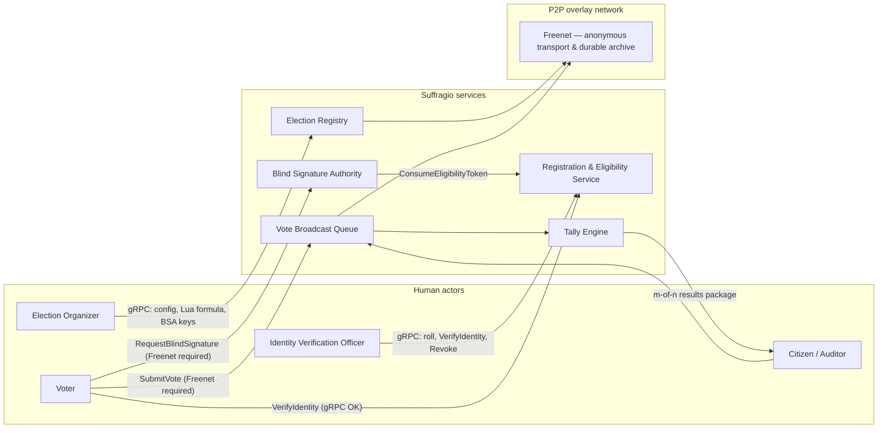
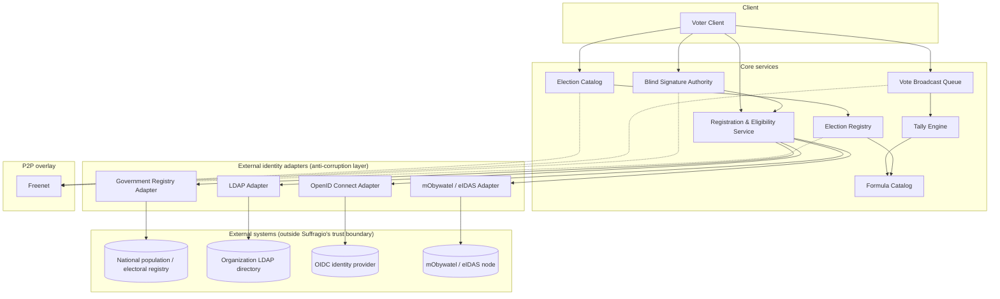
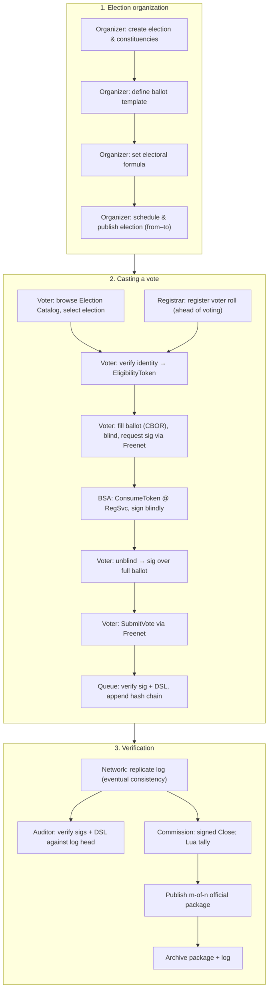

This page describes the system architecture that satisfies the goals in [Motivation & Requirements](/suffragio-spec/motivation/).

**Normative protocol rules for implementers** (cryptography, ballots, Lua tallies, auth, state machine, Freenet, audit package) are in [Protocol v1](/suffragio-spec/protocol-v1/). Wire shapes are in the [gRPC API Reference](/suffragio-spec/api-reference/) and `proto/suffragio/v1/`. If prose here disagrees with Protocol v1, **Protocol v1 wins**.

## Actors

**Human actors**

- **Voter** — an eligible citizen who verifies their identity, receives a blindly signed ballot, and casts a vote.
- **Election Organizer** — e.g. a member of a national election commission (or any organization). Defines the ballot template, the electoral formula, and publishes the election schedule.
- **Identity Verification Officer (Registrar)** — verifies a voter's identity and eligibility, either electronically (e.g. a qualified signature or a national digital ID) or in person (e.g. a municipal, county, or consular official).
- **Auditor / Citizen Observer** — any citizen who independently downloads and verifies the public vote log, signatures, and published results.

**System actors (services / nodes)**

- **Blind Signature Authority (BSA)** — consumes an eligibility token (via RegSvc) and blindly signs the **full** filled ballot, without seeing unblinded content or the voter's identity.
- **Vote Broadcast Queue** — a public, append-only, multi-writer hash-chained log (eventual consistency) of cast votes.
- **Tally Engine** — runs the election-pinned **Lua** script over the committed vote log and publishes the official m-of-n-signed results package.
- **Formula Catalog** — publishes and discovers reusable Lua tally scripts (elections always pin `content_hash`).
- **Election Catalog** — browsable directory of elections (Discovery service), aggregated across organizers/trackers.
- **Network Node Operator** — anyone running a Suffragio node.



## System components

- **Voter Client** — builds the filled ballot (deterministic CBOR), blinds it, requests a blind signature over Freenet, unblinds, submits over Freenet; keeps a local copy to find itself in the public log (no third-party receipt).
- **Election Registry** — source of truth for configuration: constituencies, ballot DSL templates, Lua formula ref + hash, BSA public key list, voting window, lifecycle state, `publish_received_at` flag.
- **Registration & Eligibility Service** — identity/roll checks, issues random single-use `EligibilityToken`s, atomic `ConsumeEligibilityToken` for BSA (no `voter_id` in response). Revoke affects rolls/new tokens only.
- **Blind Signature Authority (BSA)** — after successful consume, blindly signs the full ballot; never learns voter identity or unblinded content.
- **Vote Broadcast Queue** — multi-writer append-only hash chain; verifies BSA signature and ballot DSL; rejects invalid ballots at submit.
- **Tally Engine** — sandboxed Lua; official close via signed `CloseVotingWindow`; publishes results package (results + log head + script hash + m-of-n signatures).
- **Formula Catalog** — library of Lua scripts (presets e.g. PL Sejm/Senat/president/referendum are content, not core engines).
- **Election Catalog (Discovery)** — browsable elections and node roles across trackers.
- **External Identity Adapters** — IdentityProvider port for voters; separate pluggable **AuthZ** port for organizers (default OIDC). See below.
- **P2P overlay (Freenet)** — required anonymizing transport for BSA + SubmitVote on public elections.

## Component diagram



## Blind-signature ballot issuance

To keep eligibility verification and vote casting cryptographically unlinkable, ballots use a **versioned blind signature** scheme. Default suite: `BLIND_SIG_RSA_FDH_3072_SHA256` (see [Protocol v1](/suffragio-spec/protocol-v1/)).

1. The voter authenticates with **RegSvc** (client assertion and/or server-side session: OIDC, mObywatel, in-person, …) and receives a **random** single-use `EligibilityToken` (state held in RegSvc).
2. The voter **fills the entire ballot** first; the client encodes it as **deterministic CBOR** and validates it against the constituency ballot DSL (stable option `id`s).
3. The client blinds the suite-specific encoding of those CBOR bytes and sends them with the token to the **BSA over Freenet** (public elections).
4. BSA calls **`ConsumeEligibilityToken`** on RegSvc (atomic; response has **no** `voter_id`). On success it signs the blinded value with the selected `key_id` from the election’s BSA key list.
5. The client unblinds locally → signature verifies on the full CBOR ballot.
6. The client **`SubmitVote`s over Freenet** with `ballot`, `signature`, `key_id`. The Queue verifies the signature **and** DSL validity; invalid ballots are rejected (no append). There is **no** `receipt_hash`.

Identity-linked steps (1) stay off Freenet if needed for eID UX; authorization (4) and casting (6) stay unlinkable from identity at the BSA/Queue.

## External identity integration (anti-corruption layer)

Requiring every deployment to use one specific identity system would break the universality and digital-independence requirements: a national government, a company running an internal election, and a small association all have very different sources of truth for "who is allowed to vote, and in what constituency." The **Registration & Eligibility Service** never talks to an external identity system directly. It depends on a small internal port (client assertion **or** server session):

```text
IdentityProvider.complete(election_id, proof_or_session) -> { eligible, voter_id, constituency_id }
IdentityProvider.is_revoked(election_id, voter_id) -> bool
```

Organizer/admin authorization is a **separate** pluggable port (default OIDC JWT → action strings); Suffragio validates permissions and does not replace enterprise IdP/RBAC. See [Protocol v1](/suffragio-spec/protocol-v1/).

`voter_id` values are opaque, **stable within one election**, and **unlinkable across elections** for external observers (never raw PESEL in the API).

Each concrete integration is implemented as an **adapter** behind this port — an application of the anti-corruption layer pattern: the quirks, data models, and legacy protocols of an external system are translated and isolated in the adapter, so they never leak into Suffragio's core domain model. Proposed adapters:

- **Government Registry Adapter** — read-only integration with a national civil/electoral registry (e.g. a PESEL-based population register), used to resolve a citizen's eligibility and constituency for national elections.
- **mObywatel / eIDAS Adapter** — electronic identity verification via a national digital-identity wallet (e.g. Poland's mObywatel) or, for cross-border/EU use, any [eIDAS](https://digital-strategy.ec.europa.eu/en/policies/eidas-regulation)-compliant equivalent notified by another EU member state.
- **LDAP Adapter** — for organizations that already maintain their electorate in a directory (e.g. a company or association), resolving eligibility straight from an LDAP/Active Directory tree.
- **OpenID Connect Adapter** — federated identity via any OIDC-compliant identity provider (corporate SSO, Keycloak, Google Workspace, etc.), suitable for community or organizational elections that already have a login system.

New backends only require a new adapter implementing the same `IdentityProvider` port — the rest of the system, including the blind-signature flow, is completely unaffected.

## Communication: gRPC

All communication between the Voter Client, the Election Registry, the Registration & Eligibility Service, the Blind Signature Authority, the Vote Broadcast Queue, and the Tally Engine happens over **gRPC**:

- **Commands** are unary gRPC calls that mutate state.
- **Events** are published on gRPC server-streaming subscriptions (and mirrored onto the public Vote Broadcast Queue / archive where relevant), so any node or auditor can subscribe and independently reconstruct the full election state.

The full, implementation-ready protocol — request/response fields for every command and query, and the fields on every event — is documented on the [gRPC API Reference](/suffragio-spec/api-reference/) page, backed by the canonical `.proto` files in [`proto/suffragio/v1/`](https://github.com/Suffragio/suffragio-spec/tree/main/proto/suffragio/v1).

### Commands (summary)

Full fields: [gRPC API Reference](/suffragio-spec/api-reference/). Behaviour: [Protocol v1](/suffragio-spec/protocol-v1/).

| Service | Command | Description |
| --- | --- | --- |
| Election Registry | `CreateElection`, `DefineBallotTemplate`, `SetFormulaScript`, `AddBsaPublicKey`, `ScheduleElection`, `SetPublicTimestamps`, `TransitionElectionState`, `PublishElection` | Config, Lua pin, BSA keys, lifecycle |
| Registration & Eligibility | `RegisterVoterRoll`, `VerifyIdentity`, `RevokeVotingRights`, `ConsumeEligibilityToken` | Rolls, tokens; consume is BSA-only |
| Blind Signature Authority | `RequestBlindSignature` | Freenet (public elections); full-ballot blind sign |
| Vote Broadcast Queue | `SubmitVote`, `GetLogHead`, `ReportLogHead` | Hash chain log; no receipt |
| Tally Engine | `CloseVotingWindow`, `ComputeResults`, `PublishResults` | Signed close; Lua; m-of-n package |
| Formula Catalog | `PublishScript`, `GetScript`, `ListScripts` | Lua script library |
| Discovery | `AnnounceNode`, `DiscoverElections` | Nodes + election catalog |

Mutations use gRPC metadata `idempotency-key`. Services expose `WatchEvents` (cursor) and snapshot RPCs.

### Events (summary)

Registry: created, template, formula hash, BSA key, scheduled, state transition, published.  
RegSvc: registered, eligibility verified (no voter_id), rights revoked, token consumed.  
BSA: signature issued (anonymous).  
Queue: vote cast, log head reported (sync hint).  
Tally: window closed, results published (with package hashes).  
Formula catalog: script published.  
Discovery: node announced.

## P2P network layer: Freenet

Suffragio deliberately avoids relying on a single, centrally operated server. A government (or any other single organizer) running the only endpoint would reintroduce exactly the risks the [requirements](/suffragio-spec/motivation/) aim to eliminate: a single point of failure or censorship, an entity able to correlate a voter's network origin with their identity or ballot, and a dependency on infrastructure that isn't equally open to everyone. Running the system over an anonymizing, decentralized P2P overlay instead means no single node can block access to an election, tamper with the public vote log, or deanonymize a voter by their network connection — anyone can run a node and participate on equal footing.

The proposal runs entirely on **[Freenet](https://freenet.org)** — the actively developed, from-scratch Rust re-implementation of the original Freenet network (distinct from the legacy Java client sometimes still called Hyphanet). Every request is routed through Freenet's small-world peer-to-peer overlay, which hides a voter's network origin from the services they talk to — essential for ballot-casting anonymity independent of the blind-signature scheme.

Unlike the original, static-content-only Freenet, this Rust implementation is built around WebAssembly **contracts** that support both durable, content-addressed storage *and* near-real-time state updates delivered to subscribers. That single primitive covers both of Suffragio's needs on one network:

- **Mandatory anonymizing path (public elections)** — `RequestBlindSignature` and `SubmitVote` MUST use Freenet (or equivalent binding). `VerifyIdentity` and organizer admin RPCs MAY use plain gRPC for eID/IdP integration.
- **Durable archive** — ballot templates, the vote log, and official results packages SHOULD also be mirrored as Freenet contract state where censorship resistance matters.
- **Vote log consistency** — multi-writer hash chain with **eventual consistency**; official results may wait hours for sync. Binding commitment is the commission **m-of-n signed results package** (log head + Lua hash + results), not the first peer ACK.

Suffragio is not a single global network, either: like BitTorrent swarms coordinated by independent trackers, different organizers can run their election(s) on their own, physically separate P2P network, coordinated by their own **tracker** node (identified by its Freenet key). A voter's client discovers which network a given election lives on through the Election Catalog, then connects to that network's own Registration & Eligibility Service, Blind Signature Authority, and Vote Broadcast Queue — so one organizer's network being unreachable or compromised has no bearing on any other election.

## End-to-end voting process


