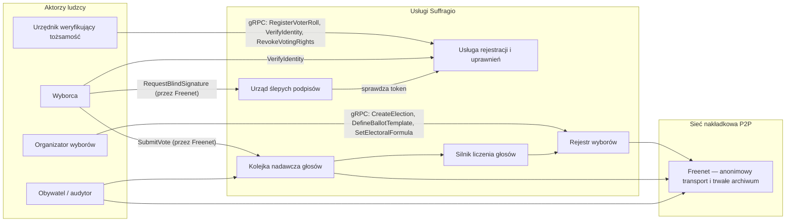
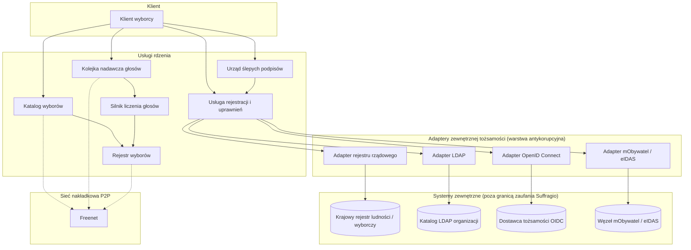
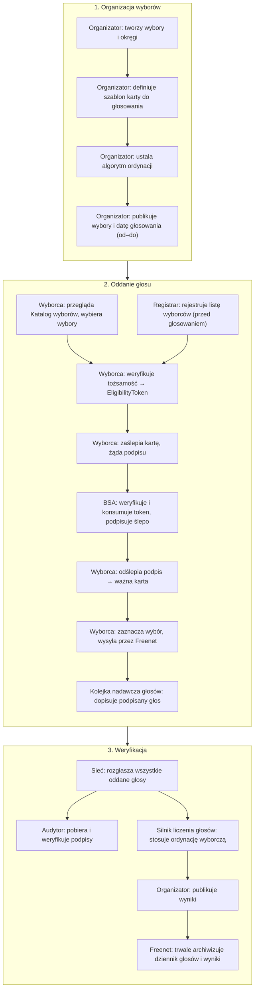

Ta strona proponuje architekturę systemu spełniającą cele i wymagania opisane na stronie [Motywacja i wymagania](/suffragio-spec/pl/motivation/). Jest to pierwszy szkic projektu, stanowiący podstawę do dalszej dyskusji i doprecyzowania.

## Aktorzy

**Aktorzy ludzcy**

- **Wyborca** — uprawniony obywatel, który weryfikuje swoją tożsamość, otrzymuje ślepo podpisaną kartę do głosowania i oddaje głos.
- **Organizator wyborów** — np. członek Państwowej Komisji Wyborczej (lub dowolnej innej organizacji). Definiuje szablon karty do głosowania, ordynację wyborczą oraz publikuje harmonogram wyborów.
- **Urzędnik weryfikujący tożsamość (Registrar)** — weryfikuje tożsamość i uprawnienia wyborcy, elektronicznie (np. podpis zaufany lub krajowa tożsamość cyfrowa) lub osobiście (np. urzędnik gminy, powiatu czy konsulatu).
- **Audytor / obywatel-obserwator** — dowolny obywatel, który samodzielnie pobiera i weryfikuje publiczny rejestr głosów, podpisy oraz opublikowane wyniki.

**Aktorzy systemowi (usługi / węzły)**

- **Urząd ślepych podpisów (Blind Signature Authority, BSA)** — weryfikuje token uprawniający wyborcę i ślepo podpisuje jego kartę, nigdy nie widząc jej treści.
- **Kolejka nadawcza głosów (Vote Broadcast Queue)** — publiczny, tylko-dopisywalny, replikowany dziennik, w którym każdy oddany głos jest rozgłaszany i widoczny dla każdego.
- **Silnik liczenia głosów (Tally Engine)** — wymienialny komponent stosujący skonfigurowaną ordynację wyborczą do dziennika głosów po zamknięciu okna głosowania.
- **Katalog wyborów (Election Catalog)** — publiczny, przeglądalny katalog nadchodzących, trwających i zakończonych wyborów, zbierany od wszystkich organizatorów w sieci.
- **Operator węzła sieciowego** — każdy, kto uruchamia węzeł Suffragio, uczestnicząc w wykrywaniu, rozgłaszaniu i archiwizacji danych wyborczych.



## Komponenty systemu

- **Klient wyborcy (Voter Client)** — lokalna aplikacja generująca współczynnik zaślepiający, wysyłająca żądanie ślepego podpisu, odślepiająca podpis i wysyłająca gotowy głos.
- **Rejestr wyborów (Election Registry)** — źródło prawdy dla niezmiennej konfiguracji wyborów: okręgi, szablony kart, ordynacja wyborcza, okno głosowania i klucze publiczne.
- **Usługa rejestracji i uprawnień** — waliduje tożsamość i okręg wyborcy, sprawdza listę uprawnionych oraz ewentualne odebranie praw, wydaje jednorazowy `EligibilityToken`.
- **Urząd ślepych podpisów (BSA)** — konsumuje `EligibilityToken` i wydaje ślepy podpis nad kartą, której nie może odczytać, gwarantując, że akt *autoryzacji* karty nigdy nie da się powiązać z aktem jej *oddania*.
- **Kolejka nadawcza głosów** — publiczna, tylko-dopisywalna tablica ogłoszeń wszystkich oddanych głosów. Nic nigdy nie jest usuwane ani modyfikowane po dopisaniu.
- **Silnik liczenia głosów** — wymienialny moduł implementujący konkretną ordynację wyborczą (np. system większościowy, metoda D'Hondta, pojedynczy głos przechodni); konsumuje kolejkę głosów i produkuje wyniki.
- **Katalog wyborów** — projekcja tylko-do-odczytu budowana przez indeksowanie zdarzeń `ElectionPublished` i `ElectionScheduled` rozgłaszanych przez wszystkich organizatorów w sieci. Działa jak listing w sklepie z aplikacjami: każdy może go przeglądać bez uwierzytelniania, aby znaleźć wybory, do których może być uprawniony, oraz zobaczyć ich harmonogram, okręgi i organizatora — zanim rozpocznie weryfikację tożsamości.
- **Adaptery zewnętrznej tożsamości (warstwa antykorupcyjna)** — rodzina adapterów tłumaczących różnorodne zewnętrzne źródła tożsamości i uprawnień na jeden, generyczny interfejs, od którego zależy usługa rejestracji i uprawnień. Zobacz [Integracja zewnętrznej tożsamości](#integracja-zewnętrznej-tożsamości-warstwa-antykorupcyjna) poniżej.
- **Sieć nakładkowa P2P** — opisana poniżej.

## Diagram komponentów



## Wydawanie kart do głosowania z użyciem ślepego podpisu

Aby zapewnić kryptograficzną niepowiązywalność weryfikacji uprawnień z oddaniem głosu, karty wyborcze są wydawane z użyciem schematu **ślepego podpisu**:

1. Wyborca uwierzytelnia się w **usłudze rejestracji i uprawnień** (elektronicznie lub osobiście) i otrzymuje jednorazowy `EligibilityToken` dla swojego okręgu.
2. Wyborca lokalnie generuje pustą kartę do głosowania i zaślepia ją losowym współczynnikiem zaślepiającym.
3. Wyborca wysyła zaślepioną kartę wraz z `EligibilityToken` do **urzędu ślepych podpisów**. BSA weryfikuje i konsumuje token, po czym podpisuje *zaślepioną* wartość — nigdy nie widząc rzeczywistej treści karty i nie mogąc powiązać tego zdarzenia z żadnym późniejszym głosem.
4. Wyborca lokalnie odślepia podpis, otrzymując ważnie podpisaną, anonimową kartę do głosowania.
5. Wyborca zaznacza swój wybór na karcie i wysyła ją — poprzez anonimowy transport sieciowy, odłączony od jego zweryfikowanej tożsamości — do **kolejki nadawczej głosów**.

Ponieważ kroki 1–3 (powiązane z tożsamością) oraz krok 5 (anonimowe oddanie głosu) są kryptograficznie i czasowo rozdzielone, żadna strona — w tym BSA i usługa rejestracji — nie jest w stanie ustalić, jak zagłosował konkretny wyborca, a mimo to podpis dowodzi, że karta pochodzi od uprawnionego, jednorazowego tokenu.

## Integracja zewnętrznej tożsamości (warstwa antykorupcyjna)

Wymuszanie jednego, konkretnego systemu tożsamości w każdym wdrożeniu łamałoby wymagania uniwersalności i niezależności cyfrowej: rząd krajowy, firma organizująca wybory wewnętrzne oraz małe stowarzyszenie mają bardzo różne źródła prawdy o tym, "kto jest uprawniony do głosowania i w jakim okręgu". **Usługa rejestracji i uprawnień** nigdy więc nie rozmawia bezpośrednio z zewnętrznym systemem tożsamości. Zależy jedynie od niewielkiego, generycznego portu wewnętrznego:

```text
IdentityProvider.verify(claimantProof) -> { eligible: bool, voterId, constituencyId }
IdentityProvider.isRevoked(voterId) -> bool
```

Każda konkretna integracja jest zaimplementowana jako **adapter** za tym portem — zastosowanie wzorca warstwy antykorupcyjnej (anti-corruption layer): specyfika, modele danych i przestarzałe protokoły systemu zewnętrznego są tłumaczone i izolowane w adapterze, dzięki czemu nigdy nie przenikają do modelu domenowego rdzenia Suffragio. Proponowane adaptery:

- **Adapter rejestru rządowego** — integracja tylko do odczytu z krajowym rejestrem cywilnym/wyborczym (np. rejestrem ludności opartym na numerze PESEL), używana do ustalenia uprawnień i okręgu obywatela w wyborach krajowych.
- **Adapter mObywatel / eIDAS** — elektroniczna weryfikacja tożsamości poprzez krajowy portfel tożsamości cyfrowej (np. polski mObywatel) lub, dla zastosowań transgranicznych/unijnych, dowolny zgodny z [eIDAS](https://digital-strategy.ec.europa.eu/en/policies/eidas-regulation) odpowiednik notyfikowany przez inne państwo członkowskie UE.
- **Adapter LDAP** — dla organizacji, które już utrzymują swój elektorat w katalogu (np. firma lub stowarzyszenie), ustalający uprawnienia bezpośrednio z drzewa LDAP/Active Directory.
- **Adapter OpenID Connect** — sfederowana tożsamość poprzez dowolnego dostawcę zgodnego z OIDC (firmowe SSO, Keycloak, Google Workspace itd.), odpowiedni dla wyborów społecznościowych lub organizacyjnych, które mają już system logowania.

Nowe zaplecza wymagają jedynie nowego adaptera implementującego ten sam port `IdentityProvider` — reszta systemu, w tym przepływ ślepego podpisu, pozostaje całkowicie niezmieniona.

## Komunikacja: gRPC

Cała komunikacja między klientem wyborcy, rejestrem wyborów, usługą rejestracji i uprawnień, urzędem ślepych podpisów, kolejką nadawczą głosów oraz silnikiem liczenia głosów odbywa się poprzez **gRPC**:

- **Komendy** to unarne wywołania gRPC modyfikujące stan.
- **Zdarzenia** są publikowane poprzez strumieniowe subskrypcje gRPC (server-streaming), a tam gdzie to istotne — również dublowane w publicznej kolejce nadawczej głosów / archiwum, dzięki czemu każdy węzeł lub audytor może się subskrybować i samodzielnie odtworzyć pełny stan wyborów.

Pełny, gotowy do implementacji protokół — pola żądania/odpowiedzi dla każdej komendy i zapytania oraz pola każdego zdarzenia — jest dokumentowany na stronie [Specyfikacja API gRPC](/suffragio-spec/pl/api-reference/), oparty na kanonicznych plikach `.proto` w [`proto/suffragio/v1/`](https://github.com/Suffragio/suffragio-spec/tree/main/proto/suffragio/v1).

### Komendy

| Usługa | Komenda | Opis |
| --- | --- | --- |
| Rejestr wyborów | `CreateElection` | Rejestruje nowe wybory i ich okręgi. |
| Rejestr wyborów | `DefineBallotTemplate` | Przypisuje szablon karty do wyborów/okręgu. |
| Rejestr wyborów | `SetElectoralFormula` | Wybiera algorytm liczenia wyników. |
| Rejestr wyborów | `ScheduleElection` | Ustawia okno głosowania (start/koniec). |
| Rejestr wyborów | `PublishElection` | Publikuje wybory jako możliwe do odnalezienia. |
| Rejestracja i uprawnienia | `RegisterVoterRoll` | Wczytuje/aktualizuje listę uprawnionych wyborców w okręgu. |
| Rejestracja i uprawnienia | `VerifyIdentity` | Weryfikuje tożsamość wyborcy i wydaje `EligibilityToken`. |
| Rejestracja i uprawnienia | `RevokeVotingRights` | Odbiera uprawnienia wyborcy (śmierć, pozbawienie praw itd.). |
| Urząd ślepych podpisów | `RequestBlindSignature` | Konsumuje `EligibilityToken` i ślepo podpisuje kartę. |
| Kolejka nadawcza głosów | `SubmitVote` | Dopisuje podpisany, anonimowy głos do publicznego dziennika. |
| Silnik liczenia głosów | `CloseVotingWindow` | Zamyka głosowanie dla wyborów. |
| Silnik liczenia głosów | `ComputeResults` | Uruchamia skonfigurowaną ordynację wyborczą na dzienniku głosów. |
| Silnik liczenia głosów | `PublishResults` | Publikuje finalne, audytowalne wyniki. |
| Discovery | `AnnounceNode` | Ogłasza obecność węzła w sieci nakładkowej. |
| Discovery | `DiscoverElections` | Odpytuje sieć o dostępne wybory. |

### Zdarzenia

| Zdarzenie | Emitowane przez | Opis |
| --- | --- | --- |
| `ElectionCreated` | Rejestr wyborów | Zarejestrowano nowe wybory. |
| `BallotTemplateDefined` | Rejestr wyborów | Przypisano szablon karty do wyborów. |
| `ElectoralFormulaSet` | Rejestr wyborów | Skonfigurowano ordynację wyborczą. |
| `ElectionScheduled` | Rejestr wyborów | Ustawiono okno głosowania. |
| `ElectionPublished` | Rejestr wyborów | Wybory stały się publicznie dostępne. |
| `VoterRegistered` | Rejestracja i uprawnienia | Wyborcę dodano do listy w okręgu. |
| `VoterEligibilityVerified` | Rejestracja i uprawnienia | Zweryfikowano tożsamość wyborcy i wydano token. |
| `VoterRightsRevoked` | Rejestracja i uprawnienia | Odebrano uprawnienia wyborcy. |
| `BlindSignatureIssued` | Urząd ślepych podpisów | Skonsumowano token i wydano ślepy podpis (anonimowo — bez treści karty). |
| `VoteCast` | Kolejka nadawcza głosów | Dopisano podpisany, anonimowy głos do publicznego dziennika. |
| `VotingWindowClosed` | Silnik liczenia głosów | Zamknięto głosowanie dla wyborów. |
| `ResultsPublished` | Silnik liczenia głosów | Obliczono i opublikowano finalne wyniki. |
| `NodeAnnounced` | Discovery | Węzeł sieci ogłosił swoją obecność. |

## Warstwa sieciowa: Freenet

Suffragio celowo nie opiera się na jednym, centralnie zarządzanym serwerze. Rząd (lub dowolny inny pojedynczy organizator) prowadzący jedyny punkt dostępu ponownie wprowadzałby dokładnie te zagrożenia, które [wymagania](/suffragio-spec/pl/motivation/) mają wyeliminować: pojedynczy punkt awarii lub cenzury, podmiot zdolny powiązać sieciowe pochodzenie wyborcy z jego tożsamością lub głosem, oraz zależność od infrastruktury niedostępnej na równych zasadach dla wszystkich. Uruchomienie systemu na anonimizującej, zdecentralizowanej sieci nakładkowej P2P oznacza natomiast, że żaden pojedynczy węzeł nie może zablokować dostępu do wyborów, zmanipulować publicznego dziennika głosów ani zdeanonimizować wyborcy na podstawie jego połączenia sieciowego — każdy może uruchomić węzeł i uczestniczyć na równych prawach.

Propozycja działa w całości na **[Freenet](https://freenet.org)** — aktywnie rozwijanej implementacji sieci Freenet napisanej od nowa w Rust (odrębnej od starszego klienta w Javie, bywającego nazywanym Hyphanet). Każde żądanie jest kierowane przez sieć nakładkową P2P typu "small-world" Freenet, co ukrywa sieciowe pochodzenie wyborcy przed usługami, z którymi się komunikuje — co jest kluczowe dla anonimowości oddania głosu, niezależnie od schematu ślepego podpisu.

W przeciwieństwie do oryginalnego Freenet, ograniczonego do publikacji statycznej treści, ta implementacja w Rust jest zbudowana wokół **kontraktów** WebAssembly, które wspierają zarówno trwałe, adresowane treścią przechowywanie danych, jak i aktualizacje stanu w czasie bliskim rzeczywistemu, dostarczane do subskrybentów. Ten jeden mechanizm pokrywa obie potrzeby Suffragio w ramach jednej sieci:

- **Żywe, interaktywne żądania** — wywołania wyborców i organizatorów do usługi rejestracji, urzędu ślepych podpisów i kolejki nadawczej głosów są realizowane poprzez aktualizacje stanu kontraktu propagowane do subskrybentów przez Freenet, więc nie jest potrzebna odrębna sieć transportowa o niskim opóźnieniu.
- **Trwałe, odporne na cenzurę archiwum** — opublikowane szablony kart, tylko-dopisywalny dziennik głosów oraz finalne wyniki są przechowywane w ten sam sposób: jako stan kontraktu Freenet, replikowany i adresowany treścią, pozostający dostępny nawet gdy węzeł publikujący przestanie działać.

Suffragio nie jest też jedną globalną siecią: podobnie jak roje BitTorrent koordynowane przez niezależne trackery, różni organizatorzy mogą prowadzić swoje wybory na własnej, fizycznie odrębnej sieci P2P, koordynowanej przez własny węzeł-**tracker** (identyfikowany kluczem Freenet). Klient wyborcy odnajduje, w jakiej sieci znajdują się dane wybory, poprzez Katalog wyborów, a następnie łączy się z usługą rejestracji i uprawnień, urzędem ślepych podpisów oraz kolejką nadawczą głosów należącymi do tej właśnie sieci — dzięki czemu niedostępność lub skompromitowanie sieci jednego organizatora nie ma wpływu na żadne inne wybory.

## Pełny proces głosowania


